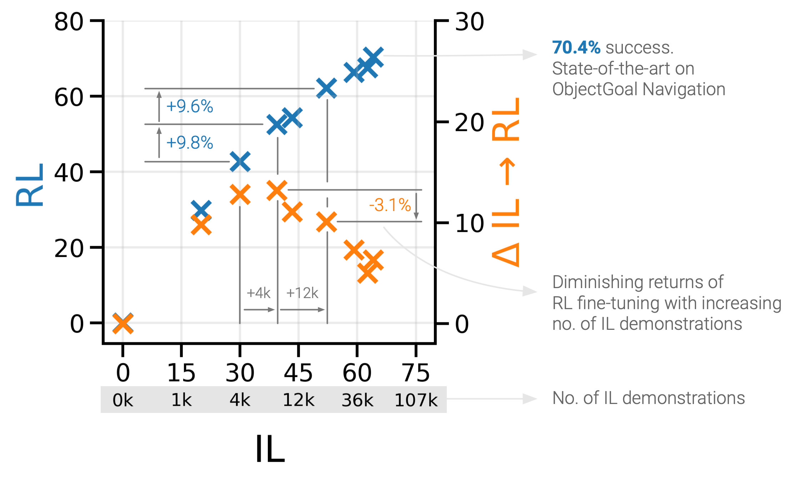

# PIRLNav: Pretraining with Imitation and RL Finetuning for ObjectNav

Code for our paper [PIRLNav: Pretraining with Imitation and RL Finetuning for ObjectNav](). 

[Project Page](https://ram81.github.io/projects/pirlnav)

Ram Ramrakhya, Dhruv Batra, Erik Wijmans, Abhishek Das


## What is PIRLNav?

PIRLNav is a two-stage learning scheme for IL pretraining on human demonstrations followed by RL-finetuning. To enable successful RL finetuning, we present a two-stage learning
scheme involving a critic-only learning phase first that gradually transitions over to training both the actor and critic. 

<p align="center">
  

  <p align="center"><i>Scaling laws of <code>IL→RL</code> for ObjectNav </i></p>
</p>

Using this IL→RL training recipe, we present a rigorous empirical analysis of design choices. We study how
RL-finetuning performance scales with the size of the IL pretraining dataset. We find that as we increase the size of the IL-pretraining dataset and get to high IL accuracies, the improvements from RL-finetuning are smaller, and that 90% of the performance of our best IL→RL policy can be achieved with less than half the number of IL demonstrations.

Read more in the [paper]().


## Installation

Run the following commands:

```
git clone https://github.com/Ram81/pirlnav.git
git submodule update --init

conda create -n pirlnav python=3.7 cmake=3.14.0

cd habitat-sim/
pip install -r requirements.txt
./build.sh --headless

pip install torch==1.12.1+cu113 torchvision==0.13.1+cu113 torchaudio==0.12.1 --extra-index-url https://download.pytorch.org/whl/cu113

cd habitat-lab/
pip install -r requirements.txt

pip install -e habitat-lab
pip install -e habitat-baselines

pip install -e .
```


## Data

### Downloading HM3D Scene and Episode Dataset

- Download the HM3D dataset using the instructions [here](https://github.com/facebookresearch/habitat-sim/blob/main/DATASETS.md#habitat-matterport-3d-research-dataset-hm3d) (download the full HM3D dataset for use with habitat)

- Move the HM3D scene dataset or create a symlink at `data/scene_datasets/hm3d`.

- Download the ObjectNav HM3D episode dataset from [here](https://github.com/facebookresearch/habitat-lab/blob/main/DATASETS.md#task-datasets).


### Download Demonstrations Dataset

You can use the following datasets to reproduce results reported in our paper.

| Dataset| Scene dataset | Split | Link | Extract path |
| ----- | --- | --- | --- | --- |
| ObjectNav-HD | HM3D | 77k | [objectnav_hm3d_hd.json.gz](https://habitat-on-web.s3.amazonaws.com/pirlnav_release/objectnav_hm3d_hd.zip) | `data/datasets/objectnav/objectnav_hm3d_hd/` |
| ObjectNav-SP | HM3D | 240k | [objectnav_hm3d_sp.json.gz](https://habitat-on-web.s3.amazonaws.com/pirlnav_release/objectnav_hm3d_sp.zip) | `data/datasets/objectnav/objectnav_hm3d_sp/` |
| ObjectNav-FE | HM3D | 70k | [objectnav_hm3d_fe.json.gz](https://habitat-on-web.s3.amazonaws.com/pirlnav_release/objectnav_hm3d_fe.zip) | `data/datasets/objectnav/objectnav_hm3d_fe/` |

The demonstration datasets released as part of this project are licensed under a [Creative Commons Attribution-NonCommercial 4.0 License](https://creativecommons.org/licenses/by-nc/4.0/legalcode).


### Dataset Folder Structure

The code requires the datasets in `data` folder in the following format:

  ```bash
  ├── habitat-web-baselines/
  │  ├── data
  │  │  ├── scene_datasets/
  │  │  │  ├── hm3d/
  │  │  │  │  ├── JeFG25nYj2p.glb
  │  │  │  │  └── JeFG25nYj2p.navmesh
  │  │  ├── datasets
  │  │  │  ├── objectnav/
  │  │  │  │  ├── objectnav_hm3d/
  │  │  │  │  │  ├── objectnav_hm3d_hd/
  │  │  │  │  │  │   ├── train/
  │  │  │  │  │  ├── objectnav_hm3d_v1/
  │  │  │  │  │  │   ├── train/
  │  │  │  │  │  │   ├── val/
  ```

## Usage

### IL Training


For training the behavior cloning policy on the ObjectGoal Navigation task use the following script:

  ```bash
  sbatch scripts/1-objectnav-il.sh <dataset_name>
  ```

  where `dataset_name` can be `objectnav_hm3d_hd`, `objectnav_hm3d_sp`, or `objectnav_hm3d_fe`

### RL Finetuning

For RL finetuning the behavior cloned policy on the ObjectGoal Navigation task use the following script:

  ```bash
  sbatch scripts/2-objectnav-rl-ft.sh /path/to/initial/checkpoint
  ```

### Evaluation

To evaluate a checkpoint trained using behavior cloning checkpoint use the following command:

  ```bash
  sbatch scripts/1-objectnav-il-eval.sh /path/to/checkpoint
  ```

For evaluating a checkpoint trained using RL finetuning use the following command: 

  ```bash
  sbatch scripts/1-objectnav-rl-ft-eval.sh /path/to/checkpoint
  ```


## Reproducing Results

We provide best checkpoints for agents trained on ObjectNav task with imitation learning and RL finetuning. You can use the following checkpoints to reproduce results reported in our paper.

| Task | Checkpoint | Success Rate | SPL |
| --- | --- | --- | --- |
| 🆕[ObjectNav](https://arxiv.org/abs/2006.13171) | [objectnav_il_hd.ckpt](https://habitat-on-web.s3.amazonaws.com/pirlnav_release/checkpoints/objectnav_il_hd.ckpt) | 64.1 | 27.1 |
| 🆕[ObjectNav](https://arxiv.org/abs/2006.13171) | [objectnav_rl_ft_hd.ckpt](https://habitat-on-web.s3.amazonaws.com/pirlnav_release/checkpoints/objectnav_rl_ft_hd.ckpt) | 70.4 | 34.1 |


## Citation

If you use this code in your research, please consider citing:

```
@article{rramrakhya2023,
      title={PIRLNav: Pretraining with Imitation and RL Finetuning for ObjectNav},
      author={Ram Ramrakhya and Dhruv Batra and Erik Wijmans and Abhishek Das},
      year={2022},
}
```

